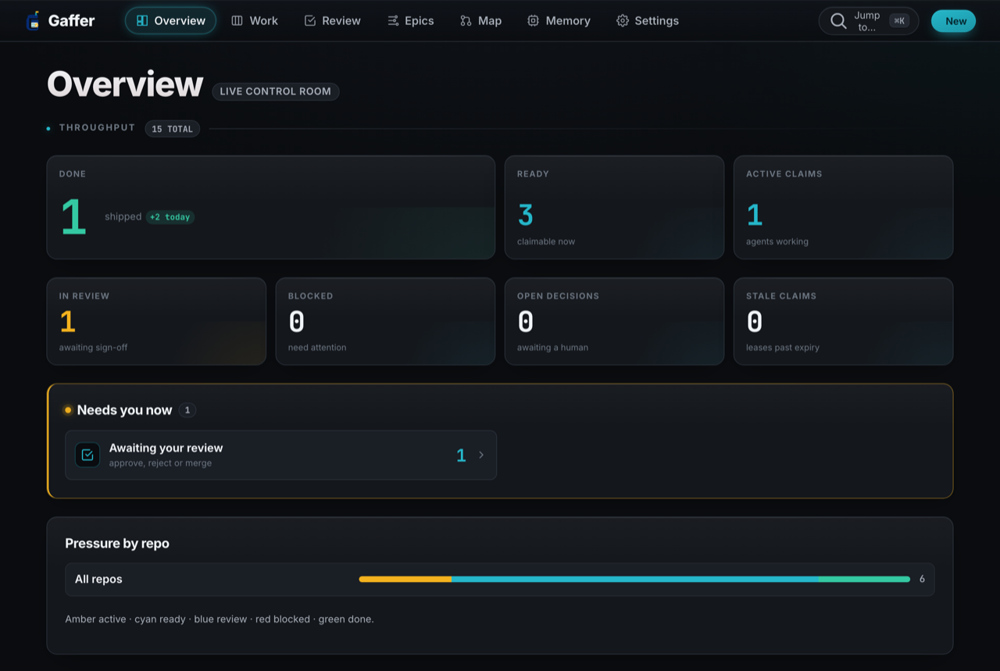
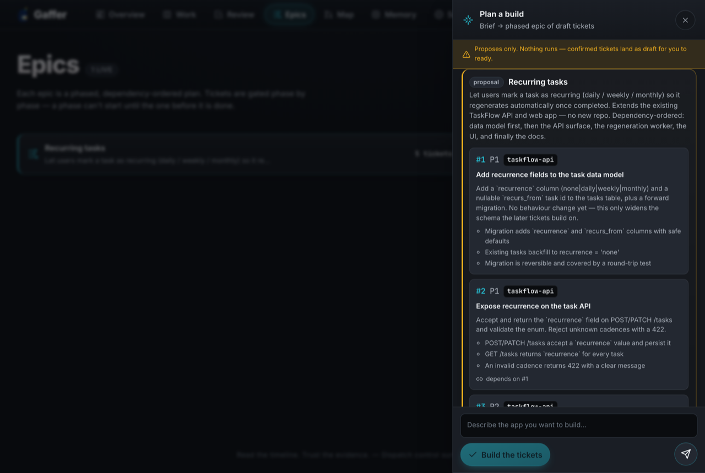
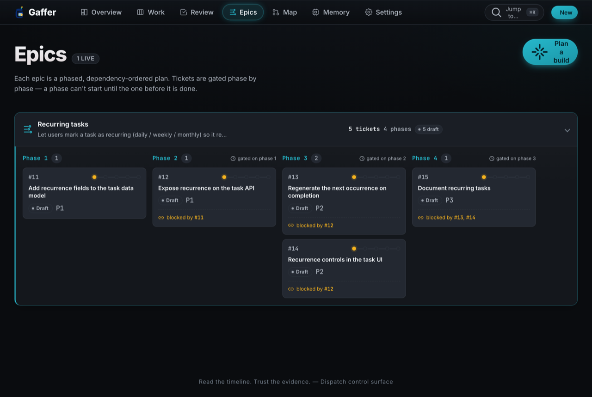
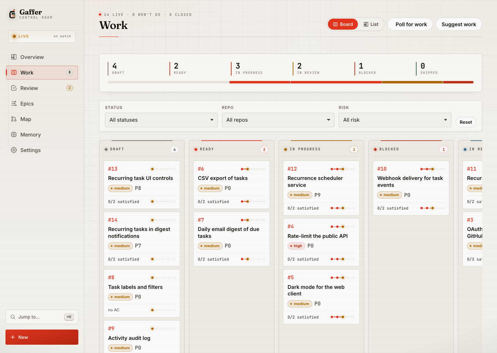
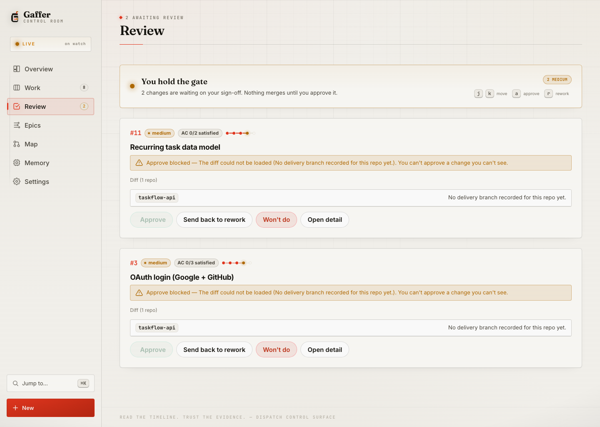
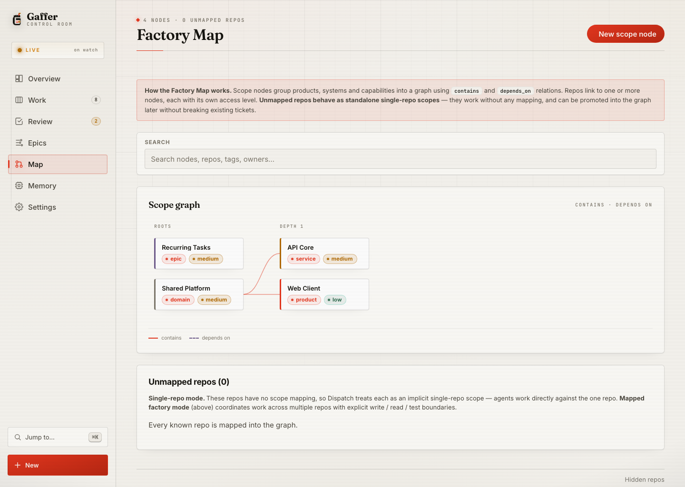
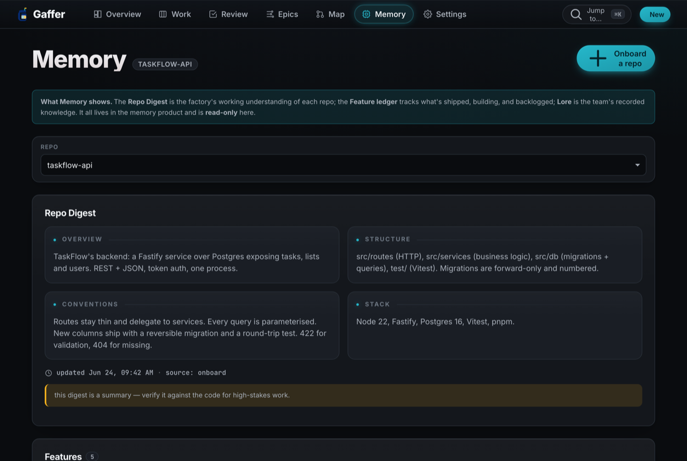
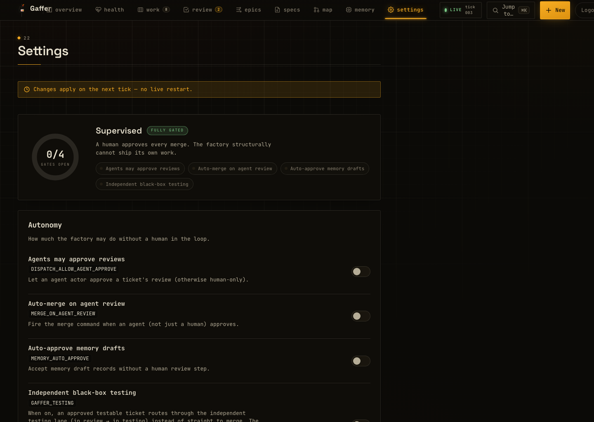

# Gaffer

[](https://github.com/tmj-90/gaffer/actions/workflows/ci.yml)
[](https://opensource.org/licenses/Apache-2.0)

**A local-first, supervised software factory.** Gaffer works a backlog of tickets into delivered, tested, reviewed code — on your own machine, against your own repos, under a human gate you control. It runs supervised by default; hands-off autonomy is opt-in.

It isn't a chat assistant that writes code. It's a *factory*: a control plane, a runtime, durable memory, and an orchestrator that works tickets through **plan → implement → test → review** and delivers each as a git branch or PR with evidence — then loops on rejection until it's right. Vague or blocked tickets park for a human rather than being forced through.

<p align="center">
  
  <br><sub><em>The control room: cycle time, throughput and flow efficiency up top, the development-flow table, what needs you now, and real per-repo progress — with live charts. (Demo data.)</em></sub>
</p>

---

## Why Gaffer

Most coding agents are stateless renters: every run starts cold, the "memory" is a vendor black box, and the only proof a task passed is a log the agent wrote about itself. Gaffer inverts all three:

- **It builds you an asset.** Every review verdict, every piece of evidence, every learned convention persists in a control plane (Dispatch) and a gated memory (Memory) that you own and can carry between repos — so the more you run it, the more context (evidence, conventions, product intent) is there to prime the next delivery.
- **It runs on your machine.** Local-first: the control plane, databases, repo state, worktrees, and evidence all live on your box — no per-seat cloud, fully auditable. Live agent runs use your configured Claude Code CLI, so prompts and selected repo context are sent to that model provider. Treat any connected model as part of your trust boundary.
- **You hold the gate.** By default a human approves every merge and the agent *structurally cannot* ship its own work. Opt-in flags unlock full hands-off autonomy when you actually want it — for **unattended** runs against input you don't fully trust, pair it with the OS sandbox (`GAFFER_MODE=strict`), which is the containment boundary once the human gate is off. See [SECURITY.md](SECURITY.md#running-it-safely).

## What it does

> The screenshots below are a neutral **demo dataset** — a fake "TaskFlow" task-management product (an API and a web client). Not anyone's real repos.

### Plan → a dependency-ordered epic of tickets

This is the headline. You give Gaffer a one-line brief — *"add recurring tasks"*, *"build an app that summarises PDFs"* — and it **decomposes it into a phased, dependency-ordered epic of tickets**, each ready to be worked through plan → implement → test → review.

It is not a single prompt that dumps a wall of code. The planner has a conversation: it asks a few **clarifying questions**, then proposes a plan where every ticket carries its own description, acceptance criteria, target repo, and an explicit **`dependsOn`** edge — so the work is *gated phase by phase* (the API can't start until the data model lands; docs come last). Nothing is created until you confirm; confirmed tickets land as **draft** for you to ready. If you'd rather skip the questions, **"Build the tickets"** forces the best plan from what it has so far — you're never stuck clarifying.

It works in two directions:

- **Greenfield** — no target repo: the plan opens with a single bootstrap ticket (`git init` + scaffold) that every other ticket depends on, so a one-liner becomes a brand-new, properly-structured repo.
- **Brownfield** — an existing repo or scope: zero bootstrap, every ticket stamped onto the target repo, so the plan *extends* what's already there instead of rebuilding it.

> **Greenfield delivery has a couple of honest first-run steps** — the brand-new repo's dependencies must be present for the test gate, and hands-off delivery is opt-in. See [**Build a whole new app from one line**](quickstart.md#5-build-a-whole-new-app-from-one-line-greenfield) in the quickstart before your first run.

<p align="center">
  
  <br><sub><em>Plan a build — the decompose sheet: greenfield or extend-existing, a one-line brief in, a phased, dependency-ordered epic out. Proposes only; nothing runs until you confirm, and confirmed tickets land as draft. (Demo data.)</em></sub>
</p>

Once confirmed, the epic is a first-class object: phases, member tickets, and the dependency graph the board enforces.

<p align="center">
  
  <br><sub><em>The same epic as a <strong>dependency graph</strong>: phases are columns (data model → API → worker + UI → docs), tickets are nodes, and <code>dependsOn</code> edges are drawn between them — solid where satisfied, dashed‑amber where still blocking. A phase‑progress strip shows the gate front advancing. (Demo data.)</em></sub>
</p>

### The work board

Every ticket moves through **draft → ready → in-progress → review** lanes, each tagged with a risk badge, a priority, acceptance-criteria progress, and the agent that claimed it. Vague tickets sit in draft until a human shapes them; blocked tickets surface rather than being forced through.

<p align="center">
  
  <br><sub><em>The work board — a flow-summary header (per-stage WIP + distribution) over lanes of tickets with risk badges and acceptance-criteria progress; one ticket claimed and in progress, one delivered and awaiting review. (Demo data.)</em></sub>
</p>

### The human review gate

When an agent delivers, the ticket lands in **Review** — and this is a *structural* barrier, not a courtesy. The agent **cannot approve or merge its own work**. The diff you sign off on is the **real `git diff`, computed server-side** against the delivery branch — never the agent's word for what it changed — and the Approve button stays disabled until that diff actually loads. Approve sends it to merge; reject loops it back for rework with your reason attached.

<p align="center">
  
  <br><sub><em>The review gate: an in-review ticket with its evidence, satisfied acceptance criteria, and the server-verified diff — Approve / send-back are yours alone. (Demo data.)</em></sub>
</p>

### The Factory Map

Repos rarely live alone. The **Factory Map** groups them into **scope nodes** (products, systems, capabilities) so the factory understands *which repos make up a product* and *what access it has to each* — `write`, `read`, `test`, or `none`. A ticket scoped to a product can reach exactly the repos that product owns, at exactly the access it's granted.

<p align="center">
  
  <br><sub><em>The scope graph: products, services, epics and external deps as nodes, laid out by containment, with <code>contains</code> (solid) and <code>depends&nbsp;on</code> (dashed) edges. Per-repo access is a boundary the runner enforces. (Demo data.)</em></sub>
</p>

### Durable repo memory

Gaffer doesn't re-learn a repo from cold on every run. **Memory** keeps a living **Repo Digest** (overview / structure / conventions / stack) and a **feature ledger** (`backlog → building → shipped`) per repo, plus a gated **lore** knowledge base — the team's recorded conventions, decisions, and cross-repo boundaries. It's the Repo Understanding engine, and it's read-only in the product: lore is curated through the memory CLI's review gate, not silently rewritten by agents.

<p align="center">
  
  <br><sub><em>The Repo Digest for an onboarded repo — overview, structure, conventions and stack, with a freshness stamp and the honest "verify against code for high-stakes work" caveat. (Demo data.)</em></sub>
</p>

### Control you opt into

The factory is **supervised by default**: a human readies tickets, a human approves merges, memory drafts wait for review. **Settings** is where you loosen that — and it's the one place every operator knob lives, grouped: **autonomy** (every flag off until you turn it on — let an agent approve reviews, auto-merge on agent review, auto-approve memory), the **delivery** cycle (auto-merge · push · PR · require-CI), **execution** & concurrency, the **idle loops** that mine backlog work between tickets, **budget & caps**, the **planning debate**, the **quality gates**, the strict **sandbox**, and **notifications**. Anything also set as a real env var wins and renders read-only.

<p align="center">
  
  <br><sub><em>Settings — the <strong>autonomy dial</strong> (how many human gates are open: 0/4 = fully supervised) over the opt-in flags, idle loops, and planning debate. Nothing here is on by default. (Demo data.)</em></sub>
</p>

For a longer walkthrough of each surface, see [`docs/FEATURES.md`](docs/FEATURES.md).

## Architecture

Four components, one workspace:

| Component | Role |
|---|---|
| **Dispatch** · `packages/dispatch` | The control plane — tickets, epics, scopes, per-repo access, the review gate. REST API + MCP server + web dashboard + CLI. |
| **Crew** · `packages/crew` | The factory runtime — factory-level MCP tools, a hooks engine, and idle loops that draft work, ingest issues, and self-improve. |
| **Runner** · `runner/` | The orchestrator — bash that spawns a `claude -p` agent per ticket, with a curated skill library, a deterministic safety hook, git-worktree isolation, and model tiering (plan on a strong model, implement on a fast one). |
| **Memory** · `packages/memory` | The durable, human-gated memory the factory learns into — the lore knowledge base plus the Repo Understanding engine (digest + feature ledger). *(Also usable standalone — see [`packages/memory/README.md`](packages/memory/README.md).)* |

```
  ticket ──▶ Runner spawns an agent ──▶ plan ▸ implement ▸ test ▸ self-review
                │                                          │
                │  (worktree-isolated, safety-hooked)      ▼
   Memory ◀──┴── learns conventions          deliver branch/PR + evidence
   (memory)                                                │
   Dispatch ◀─────────────────────────────────────────────┘
   (control plane: human review gate → merge)
```

## The Repo Understanding engine

Gaffer doesn't re-learn a repo from cold on every run. Memory keeps a living **Repo Digest** (a TLDR of overview / structure / conventions / stack) and a **feature ledger** (`backlog → building → shipped`) per repo, seeded at onboarding and refreshed deterministically as tickets merge — alongside the gated **lore** knowledge base (conventions, decisions, gotchas, cross-repo boundaries). Onboarding runs a skill-driven `claude -p` pass that produces a real digest, a feature inventory, and cited lore drafts grounded in the actual code.

Digest updates use a **prepare-at-delivery / apply-at-merge** split: the delivery agent records an inert delta while it already holds the diff in context; the merge step replays it deterministically without spawning a fresh agent. A rejected delivery never touches the digest — the prepared delta is simply discarded with the branch.

The digest is **a map, not the territory** — a fast orientation that the factory verifies against the real code for high-stakes work, never a substitute for it. (See it in the [Durable repo memory](#durable-repo-memory) screenshot above.)

## Install

**Prerequisites:**
- **Node 22 or 24** and **pnpm** (`pnpm@10.33.0`, pinned via `packageManager`)
- **Git** (the factory branches per ticket)
- **`claude` CLI**, authenticated with Anthropic — required for live agent runs; the factory spawns `claude -p` for planning, delivery, and repo analysis
- **`python3`** — used by runner helpers for JSON parsing and the portable timeout shim

```bash
git clone https://github.com/tmj-90/gaffer gaffer && cd gaffer
pnpm install      # one workspace — all components, one lockfile
pnpm -r build     # build the TypeScript packages
```

See [`quickstart.md`](quickstart.md) for a guided first run.

## Quickstart

```bash
runner/setup.sh                 # initialise factory state (DBs, config, agent identity)
DRY_RUN=1 runner/tick.sh        # preview one tick — never invokes Claude or touches a repo
runner/gaffer dashboard          # open the control-room dashboard
runner/loop.sh                  # run the factory loop (DRY_RUN=1 by default)
```

See [`quickstart.md`](quickstart.md) for the guided walkthrough and [`runner/README.md`](runner/README.md) for the full runbook.

## Safety

Gaffer runs shell-capable agents, so containment is first-class:

- a **deterministic PreToolUse safety hook** scopes writes to the worktree, blocks secret reads, denies the control-plane CLI, and **fails closed** (see [SECURITY.md](SECURITY.md) for residual limits on dynamic paths);
- every ticket runs in a **throwaway git worktree** — the real checkout is never touched;
- an optional **OS sandbox** adds a kernel-level write boundary — **macOS only today** (`sandbox-exec`); on Linux it degrades to the safety hook as the boundary until a container/VM provider is wired via the seam, and `GAFFER_STRICT_REQUIRE=1` makes that degrade **fail closed** (refuse to launch rather than run without the OS sandbox);
- the **review gate is enforced server-side** — an agent can't approve or merge its own work, and the merge gate verifies the *real git diff*, not the agent's word for it.

Opt-in autonomy, to be used deliberately: `DISPATCH_ALLOW_AGENT_APPROVE`, `MERGE_ON_AGENT_REVIEW`, `MEMORY_AUTO_APPROVE`. Full threat model and honest residual limits: [`SECURITY.md`](SECURITY.md).

## Layout

```
gaffer/
├── packages/
│   ├── dispatch/    control plane  (REST + MCP + dashboard + CLI)
│   ├── crew/   factory runtime (MCP + hooks + idle loops)
│   └── memory/    durable gated memory + repo understanding (MCP)
├── runner/           bash orchestrator, curated skill library, safety hook
├── pnpm-workspace.yaml
└── package.json
```

## Status — `0.1.0` alpha

Run-at-your-own-risk, local-first software. You run it on your machine, with your keys, against your repos — see [`SECURITY.md`](SECURITY.md) before pointing it at anything untrusted. Licensed under [Apache-2.0](LICENSE).

**What works today:**
- Dispatch queue, tickets, epics, scopes, review gate (REST + MCP + CLI)
- Crew MCP tool server (factory tools, hooks engine, idle loops, repo onboarding)
- Memory embeddings, Repo Digest, feature ledger, gated lore
- Runner factory loop with curated skill library and model tiering — one pass with `runner/loop.sh`, or unattended on any platform with `runner/gaffer run --daemon` (re-runs the loop, honours the per-day cap, stops cleanly on a signal)
- Deterministic safety hook (`runner/safety-hook.mjs`) — worktree isolation, fails closed
- Web dashboard with all seven views: Overview, Work, Review, Epics, Map, Memory, Settings

**Not yet / honest limits:**
- Container sandbox is a stub — worktree isolation plus `sandbox-exec` (macOS only, Apple-deprecated) is the current boundary; no per-subprocess network isolation
- No REST RBAC (the API token is shared; no per-user or per-scope permissions)
- Safety hook is tested on macOS; non-macOS behaviour is best-effort and untested
- No third-party skill *marketplace* yet. The bundled skills are all mounted into the repo, but the factory injects only a **stack/area-relevant subset** per ticket — `tick.sh` calls `select-skills` to pick the skills matching the repo's stack (and any derived area), plus the always-on quality lenses. `gaffer skills install` adds the whole library to your own Claude Code. Authoring a new skill is still just dropping a `SKILL.md` into `runner/skills/`.

## Credits / Inspired by

- **[ui-ux-pro-max-skill](https://github.com/nextlevelbuilder/ui-ux-pro-max-skill)** (MIT) — its design-system token architecture, component specs, states-and-variants discipline, and design-system reasoning were adapted into the `design-system` / `frontend-design` / `brand` skill packs.
- **[alirezarezvani/claude-skills](https://github.com/alirezarezvani/claude-skills)** (MIT) — adapted devops/marketing/product/docs skill packs (observability, SLO, runbook, CI/CD, incident-response, terraform, kubernetes, docker, adversarial review, API review, database schema, threat detection, cloud security, landing page, CRO, copywriting, SEO audit, schema markup, AEO, slides deck, PRD, user story, RICE, product discovery, md-document, changelog, code-tour).
- **[Matt Pocock's skills](https://github.com/mattpocock/skills)** (MIT) — caveman ultra-compressed communication pattern (voice preserved per his repo's note).

The full MIT licence text and copyright notice for each adapted source is retained in [`THIRD_PARTY_NOTICES.md`](./THIRD_PARTY_NOTICES.md).

## Trademarks & non-affiliation

Gaffer is an independent, community-driven open-source project. It is **not affiliated with, sponsored by, or endorsed by Anthropic PBC**. "Claude" and "Claude Code" are trademarks of Anthropic PBC; Gaffer uses them only to describe interoperability with the Claude Code CLI you supply and authenticate yourself. All other product names, logos, and trademarks are the property of their respective owners.
